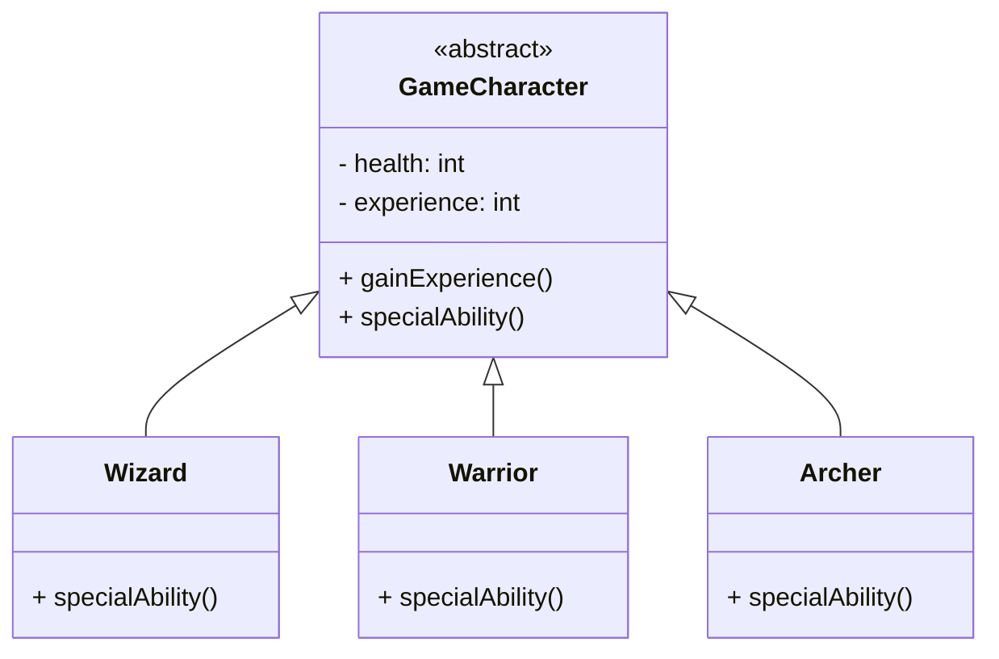

- Defines a common structure and behavior for a family of related subclasses. 
- Blend of an [[Programming Concepts/Object-oriented Programming (OOP)/Concepts/Interface|Interface]] and a [[Programming Concepts/Object-oriented Programming (OOP)/Concepts/Inheritance|superclass]], encapsulating features of both.

####  [[Programming Concepts/Object-oriented Programming (OOP)/Concepts/Interface|Interface]] and [[Programming Concepts/Object-oriented Programming (OOP)/Concepts/Inheritance|Superclass]] properties
---
**Interface-like Features:**
- Is a contract Definition.
- Has no Instantiation.

**Superclass-like Features:**
- Offers a default behavior for subclasses.
- Abstract classes can hold state for attributes.

### Purpose in OOP
---
- **Reusable Code Base:**
	- Reuse code for common functionality
	- Still enforces a certain structure in subclasses.
- **Defining a Common Blueprint:** When multiple classes share common methods and attributes but differ in their detailed implementations.
- **[[Polymorphism|Polymorphism]]:** They enable polymorphic behavior.

### Examples
---
#### Game Character

- `GameCharacter`:
	- Attributes like `health` and `experience`
	- Methods: a concrete `gainExperience()` and an abstract `specialAbility()`
- `Subclasses`: 
	- Must implement the abstract `specialAbility()` method to define unique abilities.

### Implementation
---
- [[Programming Languages/Java/Object-Oriented Programming (OOP)/Abstract Class|Java]]

### Related Topics:
---
- [[Polymorphism|Polymorphism]]
- [[Programming Concepts/Object-oriented Programming (OOP)/Concepts/Interface|Interface]]
- [[Programming Concepts/Object-oriented Programming (OOP)/Concepts/Inheritance|Inheritance]]